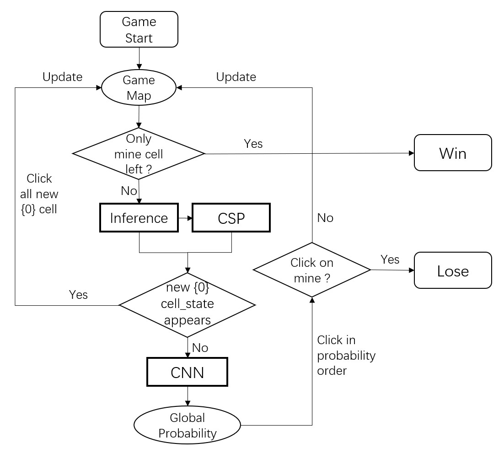

# Minesweeper_AI

A Minesweeper AI Using Inference, CSP, and CNN.

## Libraries

- PyTorch: training the network
- NumPy: calculations
- matplotlib: draw the plot

## How to

- run the test code:
  - `cd code`
  - `python3 test.py`

- check the CNN model
  - `cd model`
  - net_9: net for 9x9 grid size
  - net_12: net for 16x16 grid size

## Contact Us

- Chenyang Zhang: zhangchy1@@shanghaitech.edu.cn
- Chunxu Guo: guochx@@shanghaitech.edu.cn
- Jiahao Huang: huangjh@@shanghaitech.edu.cn
- Qianyu Liu: liuqy@@shanghaitech.edu.cn
- Tianyi Zhangchy1: zhangty2@@shanghaitech.edu.cn

